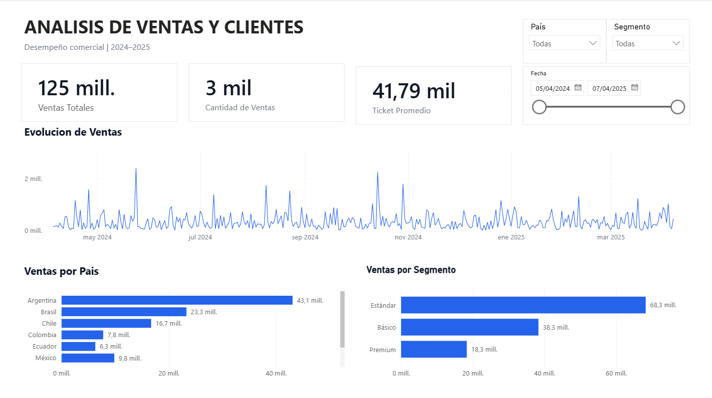
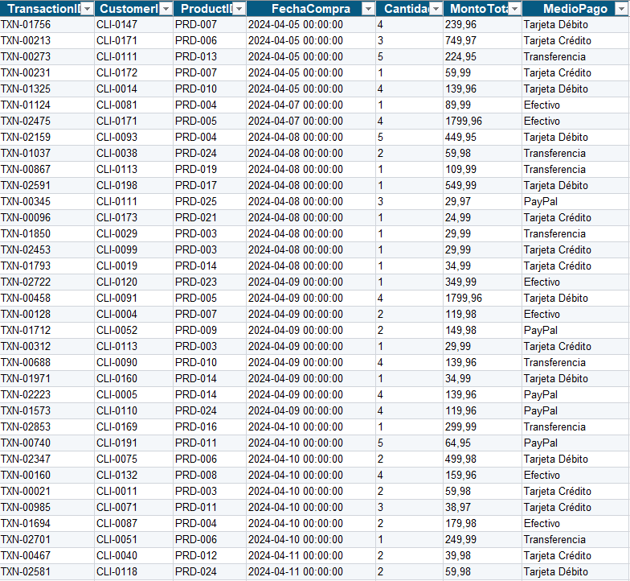
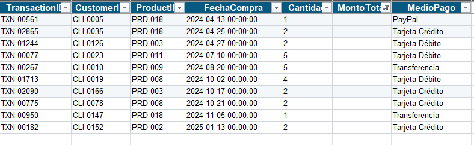
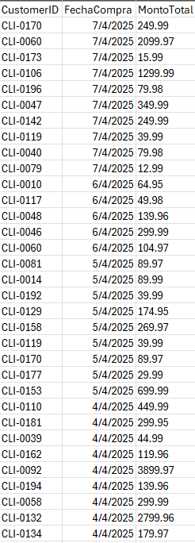
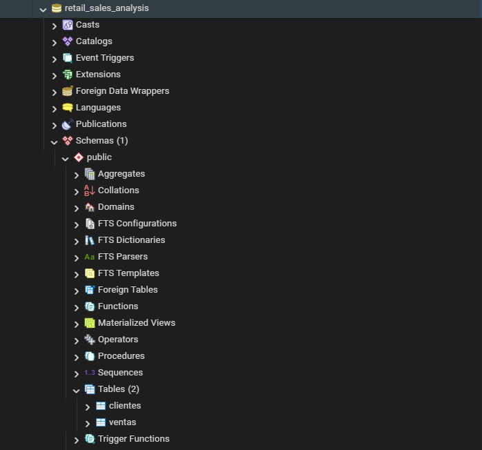
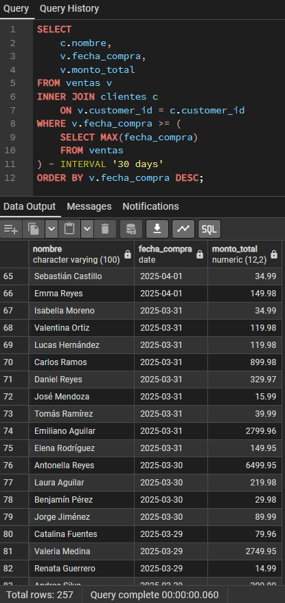
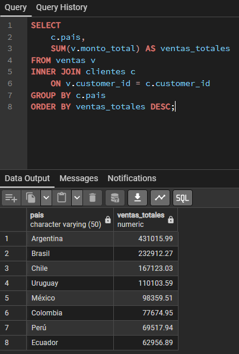
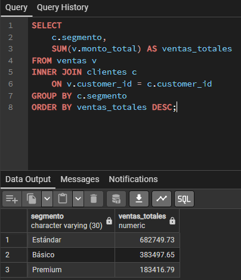
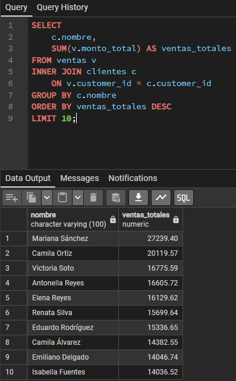
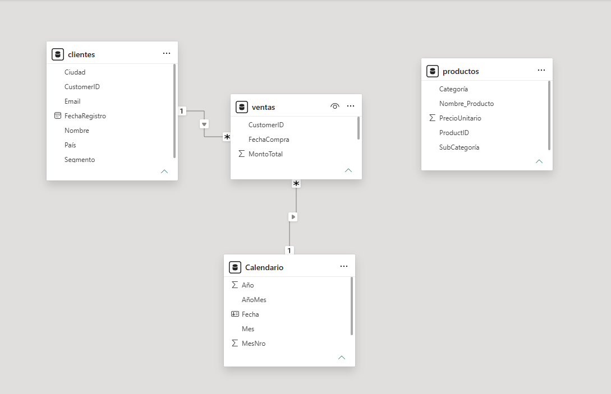

# Retail Sales Analysis

Proyecto integral de análisis de datos desarrollado como parte de una instancia educativa, utilizando **Excel, PostgreSQL, SQL y Power BI**.

El proyecto simula un escenario de análisis comercial y busca transformar datos de ventas y clientes en información útil para la toma de decisiones.

### Dashboard



## 1. Selección del dataset

Se seleccionó uno de los datasets proporcionados por el curso con fines educativos, diseñado para simular un escenario de ventas de una empresa.

El dataset contiene información relacionada con ventas, clientes y productos.

El objetivo del análisis es comprender el comportamiento de las ventas e identificar qué clientes, segmentos y países presentan una mayor participación en el negocio.

### Pregunta de negocio

> **¿Cómo se comportaron las ventas durante el período analizado y qué clientes, segmentos y países presentan un mejor desempeño?**

A partir de esta pregunta se busca analizar la evolución de las ventas e identificar los países, segmentos y clientes con mayor volumen de ventas durante el período analizado.



---

## 2. Preparación y limpieza de datos

La preparación y adaptación de los datos se realizó utilizando **Microsoft Excel**, antes de cargarlos en PostgreSQL.

Los datos fueron organizados en tres tablas principales:

* **Ventas:** contiene `CustomerID`, `FechaCompra` y `MontoTotal`.
* **Clientes:** contiene `CustomerID`, nombre, email, país, ciudad, segmento y fecha de registro.
* **Productos:** contiene `ProductID`, nombre del producto, categoría, subcategoría y precio unitario.

Durante esta etapa se realizaron las siguientes tareas:

* Revisión de valores vacíos.
* Eliminación de registros con valores faltantes.
* Revisión y normalización de los formatos de fecha.
* Revisión de los nombres de las columnas.
* Adaptación del formato de los valores numéricos para su posterior carga en PostgreSQL.

### Tratamiento de valores vacíos

Durante la revisión de la tabla **Ventas** se identificaron registros con valores vacíos en `MontoTotal`.

Estos registros fueron eliminados antes de continuar con el proceso de carga y análisis.



### Preparación de la tabla Ventas

Se eliminaron las columnas que no eran necesarias para el análisis, conservando `CustomerID`, `FechaCompra` y `MontoTotal`.

Además, los importes de `MontoTotal` utilizaban una coma como separador decimal. Para evitar errores durante la importación a PostgreSQL, se reemplazó la coma por un punto.

Por ejemplo:

`249,99 → 249.99`



Una vez finalizada la limpieza y adaptación en Excel, los archivos fueron guardados en formato **CSV**.

---

## 3. Carga de datos en PostgreSQL

Los archivos CSV fueron cargados en PostgreSQL mediante **pgAdmin 4**.

Se creó la base de datos `retail_sales_analysis`, donde se incorporaron las tablas `clientes` y `ventas`.

La carga de los datos en PostgreSQL permitió posteriormente realizar consultas SQL para explorar la información y responder las preguntas de negocio planteadas.



---

## 4. Análisis mediante SQL

Con los datos cargados en PostgreSQL, se realizaron distintas consultas SQL con el objetivo de explorar la información y responder las preguntas de negocio planteadas.

Las consultas permitieron analizar el comportamiento de las ventas, identificar los clientes con mayor participación y comparar el desempeño entre los distintos países y segmentos.

### 4.1. Ventas realizadas en los últimos 30 días

Para comenzar el análisis se identificaron las ventas realizadas durante los últimos 30 días del período disponible en la base de datos.

La consulta relaciona las tablas `ventas` y `clientes` mediante `customer_id`, permitiendo obtener el nombre del cliente junto con la fecha y el monto de cada operación.

Para determinar dinámicamente el período analizado, se utilizó una subconsulta que obtiene la fecha máxima registrada en `ventas` y, a partir de ella, se calculan los últimos 30 días.

```sql
SELECT
    c.nombre,
    v.fecha_compra,
    v.monto_total
FROM ventas v
INNER JOIN clientes c
    ON v.customer_id = c.customer_id
WHERE v.fecha_compra >= (
    SELECT MAX(fecha_compra)
    FROM ventas
) - INTERVAL '30 days'
ORDER BY v.fecha_compra DESC;
```

**Conceptos utilizados:**

* `INNER JOIN`
* `MAX()`
* Subconsulta
* `INTERVAL`
* `ORDER BY`



### 4.2. Ventas totales por país

Se analizaron las ventas totales agrupadas por país para identificar los mercados con mayor volumen de ventas.

```sql
SELECT
    c.pais,
    SUM(v.monto_total) AS ventas_totales
FROM ventas v
INNER JOIN clientes c
    ON v.customer_id = c.customer_id
GROUP BY c.pais
ORDER BY ventas_totales DESC;
```

**Conceptos utilizados:**

* `INNER JOIN`
* `SUM()`
* `GROUP BY`
* `ORDER BY`



### 4.3. Ventas totales por segmento

Se analizaron las ventas agrupadas según el segmento de cada cliente.

```sql
SELECT
    c.segmento,
    SUM(v.monto_total) AS ventas_totales
FROM ventas v
INNER JOIN clientes c
    ON v.customer_id = c.customer_id
GROUP BY c.segmento
ORDER BY ventas_totales DESC;
```

**Conceptos utilizados:**

* `INNER JOIN`
* `SUM()`
* `GROUP BY`
* `ORDER BY`



### 4.4. Clientes con mayor facturación

Finalmente, se identificaron los 10 clientes con mayor volumen de ventas.

```sql
SELECT
    c.nombre,
    SUM(v.monto_total) AS ventas_totales
FROM ventas v
INNER JOIN clientes c
    ON v.customer_id = c.customer_id
GROUP BY c.nombre
ORDER BY ventas_totales DESC
LIMIT 10;
```

**Conceptos utilizados:**

* `INNER JOIN`
* `SUM()`
* `GROUP BY`
* `ORDER BY`
* `LIMIT`



Las consultas SQL utilizadas en el proyecto se encuentran disponibles en la carpeta [`sql`](sql/).

---

## 5. Modelado de datos en Power BI

Una vez finalizado el análisis en PostgreSQL, los datos fueron incorporados a Power BI para construir el modelo analítico y desarrollar el dashboard.

El modelo está compuesto por cuatro tablas:

* **`ventas`**: tabla de hechos principal, que contiene las transacciones, fechas de compra y montos totales.
* **`clientes`**: dimensión con información descriptiva de los clientes.
* **`Calendario`**: dimensión de tiempo utilizada para realizar el análisis temporal de las ventas.
* **`productos`**: tabla con información del catálogo de productos.

### Relaciones

La tabla `clientes` se relaciona con `ventas` mediante `CustomerID`, con una cardinalidad **1 a muchos (1:*)** y dirección de filtro única.

La tabla `Calendario` se relaciona con `ventas` mediante `Fecha` y `FechaCompra`, respectivamente. Esta relación permite realizar análisis temporales.

La tabla `productos` permanece desconectada del modelo debido a que la tabla `ventas` no contiene un identificador `ProductID` que permita establecer una relación entre ambas tablas.



---

## 6. Medidas DAX

Para construir los principales indicadores del dashboard se desarrollaron medidas utilizando **DAX (Data Analysis Expressions)**.

### Ventas Totales

```DAX
Ventas Totales = SUM(ventas[MontoTotal])
```

Calcula el importe total de las ventas registradas.

### Cantidad de Ventas

```DAX
Cantidad de Ventas = COUNTROWS(ventas)
```

Calcula la cantidad de operaciones de venta registradas.

### Ticket Promedio

```DAX
Ticket Promedio = DIVIDE([Ventas Totales], [Cantidad de Ventas])
```

Calcula el valor promedio de cada operación de venta.

---

## 7. Dashboard en Power BI

A partir del modelo de datos y las medidas DAX desarrolladas, se construyó un dashboard interactivo en Power BI orientado al análisis del comportamiento de las ventas.

El dashboard permite analizar:

* **Ventas Totales**
* **Cantidad de Ventas**
* **Ticket Promedio**
* **Evolución de las ventas a lo largo del tiempo**
* **Distribución de las ventas por país**
* **Distribución de las ventas por segmento**

Además, se incorporaron filtros interactivos de **País**, **Segmento** y **Fecha**, permitiendo explorar los resultados según diferentes períodos y características de los clientes.

### Dashboard final


El archivo `.pbix` se encuentra disponible en la carpeta [`powerbi`](powerbi/).

---

## 8. Principales Insights

A partir del análisis realizado mediante SQL y Power BI se identificaron los siguientes aspectos:

1. **Argentina es el principal mercado:** presenta el mayor volumen de ventas entre los países analizados, con **43,1 mill.**

2. **Predominio del segmento Estándar:** el segmento **Estándar** concentra el mayor volumen de ventas, con **68,3 mill.**, seguido por Básico con **38,3 mill.** y Premium con **18,3 mill.**

3. **Alta variabilidad en las ventas:** la evolución temporal muestra un comportamiento marcado por picos puntuales de facturación, en lugar de mantener un nivel constante de ventas durante todo el período analizado.

4. **Picos destacados durante 2024:** se observan períodos de mayor actividad, especialmente alrededor de **mayo, agosto/septiembre y noviembre de 2024**.

5. **Clientes con mayor facturación:** el análisis permitió identificar a los clientes con mayor volumen de ventas. **Mariana Sánchez** presenta el mayor volumen con **27.239,40**, seguida por **Camila Ortiz** con **20.119,57** y **Victoria Soto** con **16.775,59**.

---

## 9. Plan de acción y recomendaciones

A partir de los insights identificados, se proponen las siguientes acciones orientadas a profundizar el análisis y mejorar la toma de decisiones comerciales:

1. **Fortalecer el mercado principal:** analizar las características de los clientes y productos asociados al mayor volumen de ventas en Argentina para identificar oportunidades de crecimiento y fidelización.

2. **Analizar el segmento Estándar:** estudiar qué factores explican su mayor volumen de ventas y evaluar estrategias para mantener su desempeño y detectar oportunidades de crecimiento en los demás segmentos.

3. **Investigar los picos de ventas:** analizar las fechas y características de las operaciones correspondientes a los principales picos de facturación para identificar posibles patrones, campañas o factores estacionales.

4. **Desarrollar estrategias para clientes de mayor facturación:** identificar características comunes entre los principales clientes y evaluar acciones de fidelización y retención.

5. **Profundizar el análisis de mercados con menor volumen:** estudiar el comportamiento de los clientes y segmentos en los países con menor nivel de ventas para detectar oportunidades de crecimiento.

---

## 10. Herramientas utilizadas

* **Microsoft Excel:** preparación y limpieza de los datos.
* **PostgreSQL:** almacenamiento y consulta de los datos.
* **pgAdmin 4:** gestión de la base de datos y ejecución de consultas SQL.
* **Power BI:** modelado, creación de medidas DAX y desarrollo del dashboard.

---

## 11. Conclusión

El proyecto permitió desarrollar un flujo completo de análisis de datos, comenzando con la preparación y limpieza de la información en Excel, continuando con su carga y análisis mediante PostgreSQL y SQL, y finalizando con el modelado y la visualización de los resultados en Power BI.

El resultado es un dashboard interactivo que permite analizar el comportamiento de las ventas desde diferentes perspectivas y facilita la identificación de tendencias y oportunidades comerciales.

### Estructura del proyecto

```text
Data-Analytics/
│
├── README.md
│
├── sql/
│   ├── 01_ventas_ultimos_30_dias.sql
│   ├── 02_ventas_por_pais.sql
│   ├── 03_ventas_por_segmento.sql
│   └── 04_top_clientes.sql
│
├── powerbi/
│   └── retail_sales_dashboard.pbix
│
└── images/
    ├── 01_dataset_original.png
    ├── 02_valores_vacios.png
    ├── 03_preparacion_ventas.png
    ├── 04_postgresql_database.png
    ├── 05_sql_ultimos_30_dias.png
    ├── 06_sql_ventas_pais.png
    ├── 07_sql_ventas_segmento.png
    ├── 08_sql_top_clientes.png
    ├── 09_modelo_powerbi.png
    └── 10_dashboard_final.png
```
